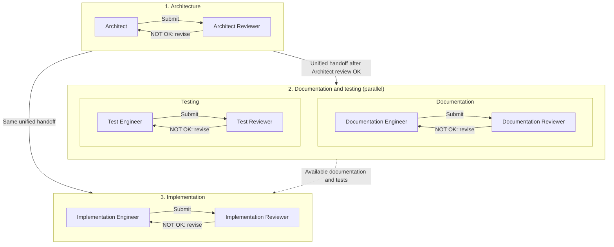

# DirectKG agent workflow

These are independent initial prompts for separate AI conversations. The project owner selects assignments, accepts design decisions and relays review handoffs. Each role retrieves repository files directly from GitHub; handoffs supply decisions, scope, revisions and review findings, not manually uploaded repository files.

## Active prompts

| Role | Prompt |
| --- | --- |
| Adviser | [adviser/adviser.md](adviser/adviser.md) |
| Architect | [architect/architect.md](architect/architect.md) |
| Architect Reviewer | [architect/architect-reviewer.md](architect/architect-reviewer.md) |
| Documentation Engineer | [documentation/documentation-engineer.md](documentation/documentation-engineer.md) |
| Documentation Reviewer | [documentation/documentation-reviewer.md](documentation/documentation-reviewer.md) |
| Test Engineer | [test/test-engineer.md](test/test-engineer.md) |
| Test Reviewer | [test/test-reviewer.md](test/test-reviewer.md) |
| Implementation Engineer | [implementation/implementation-engineer.md](implementation/implementation-engineer.md) |
| Implementation Reviewer | [implementation/implementation-reviewer.md](implementation/implementation-reviewer.md) |

## Periodic auditors

These four independent roles run only when manually invoked. Each audits the complete current state of its area and relevant cross-artifact relationships across development iterations, independently of earlier agent reports. Invocation starts the audit; no creator handoff, upstream reviewer OK or other active agent is required.

| Role | Prompt |
| --- | --- |
| Architecture Auditor | [architect/architect-auditor.md](architect/architect-auditor.md) |
| Implementation Auditor | [implementation/implementation-auditor.md](implementation/implementation-auditor.md) |
| Test Auditor | [test/test-auditor.md](test/test-auditor.md) |
| Documentation Auditor | [documentation/documentation-auditor.md](documentation/documentation-auditor.md) |

Auditors retrieve the requested branch/ref (default main), identify its full SHA, inspect actual repository evidence and report coverage and limitations. They remain read-only, distinguish confirmed defects, investigation needs and architectural/owner decisions, and route findings to the responsible existing role through the owner.

Audits are outside the execution and acceptance pipeline below. They do not issue workflow OK/NOT OK verdicts, close or waive gates, accept new semantics, launch other agents or authorize repairs. Prior review does not prevent a substantiated audit finding. The owner selects follow-up; corrections retain role ownership and independent review under the distinctions below. No additional persistent audit ledger or approval stage is required.

## Execution and acceptance

For assignments introducing, modifying or implementing a registered architectural decision, preserve this logical workflow and each role's independent review; downstream execution has no cross-agent sign-off gates:

```mermaid
flowchart TB
    subgraph architecture["1. Architecture"]
        direction LR
        A["Architect"] -->|Submit| AR["Architect Reviewer"]
        AR -->|NOT OK: revise| A
    end

    subgraph preparation["2. Documentation and testing (parallel)"]
        direction TB
        subgraph documentation["Documentation"]
            direction LR
            D["Documentation Engineer"] -->|Submit| DR["Documentation Reviewer"]
            DR -->|NOT OK: revise| D
        end
        subgraph testing["Testing"]
            direction LR
            T["Test Engineer"] -->|Submit| TR["Test Reviewer"]
            TR -->|NOT OK: revise| T
        end
    end

    subgraph implementation["3. Implementation"]
        direction LR
        I["Implementation Engineer"] -->|Submit| IR["Implementation Reviewer"]
        IR -->|NOT OK: revise| I
    end

    architecture -->|Unified handoff after Architect review OK| preparation
    architecture -->|Same unified handoff| implementation
    preparation -.->|Available documentation and tests| implementation
```

For architectural decision implementation, Architect Reviewer OK remains required for the exact registered decision, scope and revision/disposition. The Architect then generates one self-contained handoff, copied unchanged to all three downstream engineers as their primary input. Documentation/testing logically prepare implementation, but each engineer proceeds independently without waiting for another downstream agent's completed work, disposition, reviewer OK or no-action confirmation. Each submission retains its own independent review: NOT OK returns it to its producing role for correction or resolution of the blocker and a current review disposition. An engineer's justified no-change result also retains its own review, without an artificial edit or empty commit or a separate OK/nothing-to-do message to unblock another engineer; eligible prior substantive review may be reused as below. BLOCKED is not completed work. An ordinary assignment does not waive architectural review. Other sequencing exceptions need an explicit task-specific owner instruction identifying the affected requirement and scope, carried in the handoff and checked by the reviewer; all unaffected gates remain required.

For independent audit defects in existing documentation, tests or implementation, the owner may explicitly assign remediation directly to the responsible engineer when it can be completed entirely under already accepted specifications. The engineer and reviewer must verify that no new normative behavior is introduced. No new Architect registration or Architect Reviewer OK is required as an entry prerequisite for that remediation. Audit findings alone authorize neither work nor acceptance. Ownership, one-assignment-at-a-time limits and the responsible independent review remain required; downstream execution remains independent. An unresolved semantic question, normative gap or proposed change to accepted behavior returns the affected decision to the Architect and normal architectural review before implementation of that decision. Classify by the substance of the work, not its audit label.

For a correction or no-change disposition, reuse earlier substantive review only when available, sufficient independent evidence covers the same artifacts, behavior and relevant scope; no substantive defects remain; the earlier blocker was exclusively procedural; the owner explicitly waived that exact prerequisite for this assignment; relevant artifacts and governing requirements are unchanged; and no new evidence invalidates the assessment. The responsible reviewer verifies identities, scope, relevant changes and the exact waiver, performs only the additional checks needed to resolve that blocker, and issues a current disposition referencing the prior verdict/revision, reused evidence, waiver and new checks. Changes elsewhere or advancement of main alone do not require complete re-review. Reuse does not retrospectively convert NOT OK to OK. If any condition fails, the required substantive review and unwaived gates remain necessary; a procedural waiver cannot excuse substantive defects or replace an independent review that never occurred.

The Adviser operates independently. The Architect investigates design decisions and registers owner-approved changes in the specification and open issues. Reviewers verify independently and never silently correct files or create design authority.

The owner accepts substantive design before registration; reviewer acceptance verifies the recorded result. A published commit alone is not a review verdict. Tests accepted by their reviewer can still fail against incomplete production; implementation uses their actual expectations and failures while the accepted specification remains normative.

## Repository context and ownership

Discover current non-archived documents in [documentation/specification/](../specification/), checking titles, authority and current history rather than sorting historical filenames. Current entry points are [transformation-specification.md](../specification/transformation-specification.md), [open-design-issues.md](../specification/open-design-issues.md), [documentation-structure.md](../specification/documentation-structure.md), and [test-suite-structure.md](../specification/test-suite-structure.md).

The Architect owns accepted specification/open-issue registration. Documentation, test and implementation engineers own their respective artifacts; each has a separate reviewer. The specification governs behavior, structure documents govern placement, tests provide executable evidence and code establishes observed functionality. Historical documents, examples and unresolved alternatives cannot create requirements.

Writers normally publish their authorized future work to main using non-force updates and concurrency checks, then submit for independent review. Explicit task-specific branch restrictions override that default. Reviewer roles are read-only. These prompts do not authorize an agent to start another role or send its handoff itself.

Handoffs identify exact approved scope, source and submitted/snapshot SHAs, changed paths or no-change evidence, requirement-to-artifact coverage, checks/results/limitations and prior findings for corrections. Identify architectural review evidence or the explicit owner remediation assignment and accepted specification basis, plus any task-specific procedural waiver. For review reuse, include the prior verdict/revision/scope and unchanged-artifact/requirement evidence; the reviewer records the reused assessment, new checks and current disposition in its verdict. Refer to each role's full protocol. No additional persistent approval ledger is required.

## Active and archived versions

Each role directory contains its current, unversioned prompts and an `archive/` subdirectory for superseded versions. Archived prompts provide historical context and do not govern current agents.

Archive filenames follow `<document-name>-YYYYMMDDTHHMMSSZ.md`: UTC to seconds from the outgoing revision's last content-changing commit, following pure moves or renames with unchanged content. This matches the specification archive convention.

When replacing a prompt, preserve its exact predecessor bytes and file mode, preferably by reusing the Git blob. Never overwrite different historical content; a verified identical archive can be reused. Publish preservation and replacement together in an atomic commit. The Architect applies the corresponding procedure separately to each modified authoritative document in `documentation/specification/archive/`.
